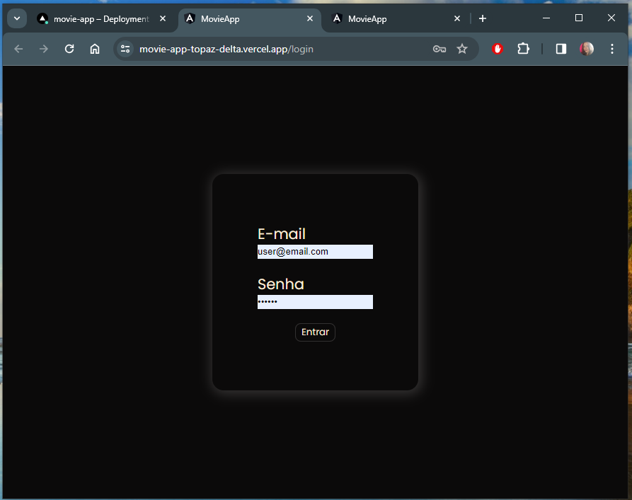
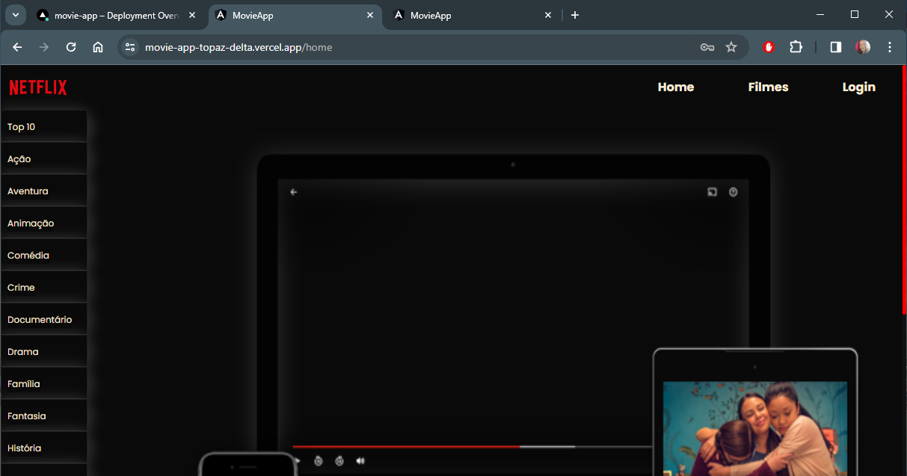

<h1 align="center"> Sobre o Projeto </h1>

Este projeto faz parte do programa de formação de desenvolvedores Full Stack [**DEVinHouse do Lab 365**](https://devinhouse.tech/).

# MovieApp

O MovieApp é a página web do lado do cliente de um serviço de streaming de filmes, projetado com um visual minimalista para permitir que os usuários se concentrem no que realmente importa: assistir!

 

## Como Utilizar a Aplicação

Para utilizar a aplicação, é necessário:

- Angular CLI (v15.1.5 ou superior). Clique [aqui](https://angular.io/cli) para mais informações.

- Baixar o repositório para sua máquina e rodar o comando `npm install`.

- Após executar o comando `ng serve`, acesse a aplicação utilizando o email: `user@email.com` e a senha: `123456`.

## Acesso

Para acessar o MovieApp, clique [aqui](https://movie-app-topaz-delta.vercel.app/) e faça login utilizando o email: `user@email.com` e a senha: `123456`.

###### Tags:

`Angular` `HTML` `SCSS` `JavaScript` `TypeScript` `Bootstrap`
